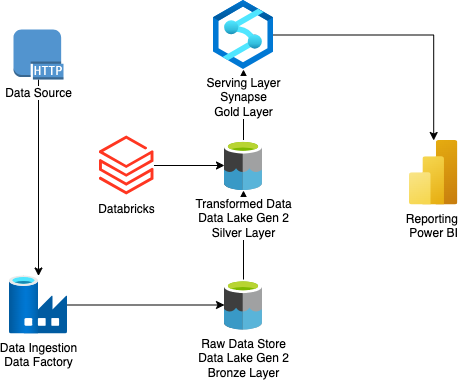

# Azure End-to-End Data Engineering Pipeline 🚀

This project demonstrates the creation of an End-to-End Data Engineering Pipeline on Azure Cloud, showcasing how raw data is transformed and analyzed using Azure tools like Data Factory, Databricks, Data Lake, Synapse, and Power BI. The pipeline is built using the Medallion Architecture with layers: Bronze, Silver, and Gold, ensuring data is processed efficiently and insights are delivered.

## Pipeline Architecture

The architecture follows the Medallion Structure, including the following layers:

- **Bronze Layer**: Raw data storage.
- **Silver Layer**: Transformed and cleaned data.
- **Gold Layer**: Serving layer for analysis and reporting.

## Steps in the Pipeline

### 1. Data Ingestion

- **Source**: Data fetched from an online GitHub repository using HTTP.
- **Tool**: Azure Data Factory.
- **Process**: Data Factory's For Each activity is used to extract the raw data and load it into the Bronze Layer of the Data Lake.

### 2. Data Transformation

- **Tool**: Azure Databricks.
- **Process**:
  - Spark clusters in Databricks are used to:
    - Transform the raw data from the Bronze Layer.
    - Clean and refine the data.
  - Save the transformed data into the Silver Layer of the Data Lake.

### 3. Data Serving

- **Tool**: Azure Synapse Analytics.
- **Process**:
  - Synapse acts as the Gold Layer, serving as the top layer of the pipeline.
  - Data is prepared for reporting and business intelligence.

### 4. Data Visualization

- **Tool**: Microsoft Power BI.
- **Process**:
  - The cleaned and transformed data from the Gold Layer is visualized in Power BI.
  - Creating interactive dashboards and reports to provide actionable insights.

## Key Tools and Technologies

- **Azure Data Factory**: For data ingestion and orchestration.
- **Azure Data Lake Gen2**: For raw and processed data storage.
- **Azure Databricks**: For data transformation using Spark.
- **Azure Synapse Analytics**: For serving the transformed data.
- **Power BI**: For visualizing and generating insights from the data.

## Outcomes

- Built an automated, scalable data pipeline leveraging Azure's cloud infrastructure.
- Efficiently transformed raw data into actionable insights using Databricks and Synapse.
- Delivered interactive reports and dashboards through Power BI.

## Future Improvements

- Add support for real-time data streaming.
- Incorporate orchestration with Kubernetes or Azure Functions for enhanced scalability.
